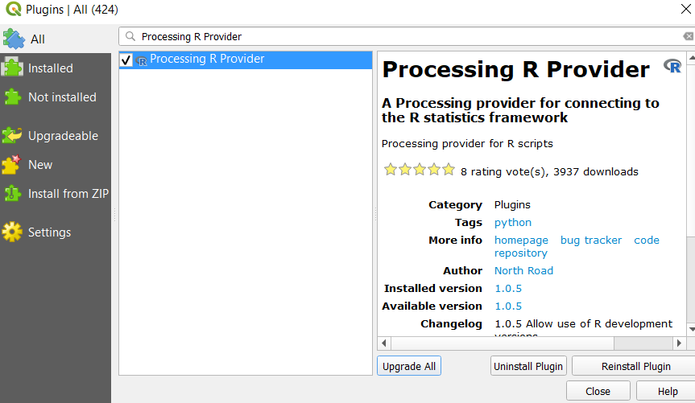
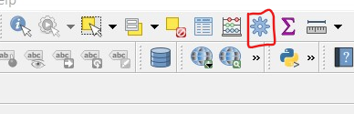
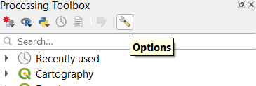
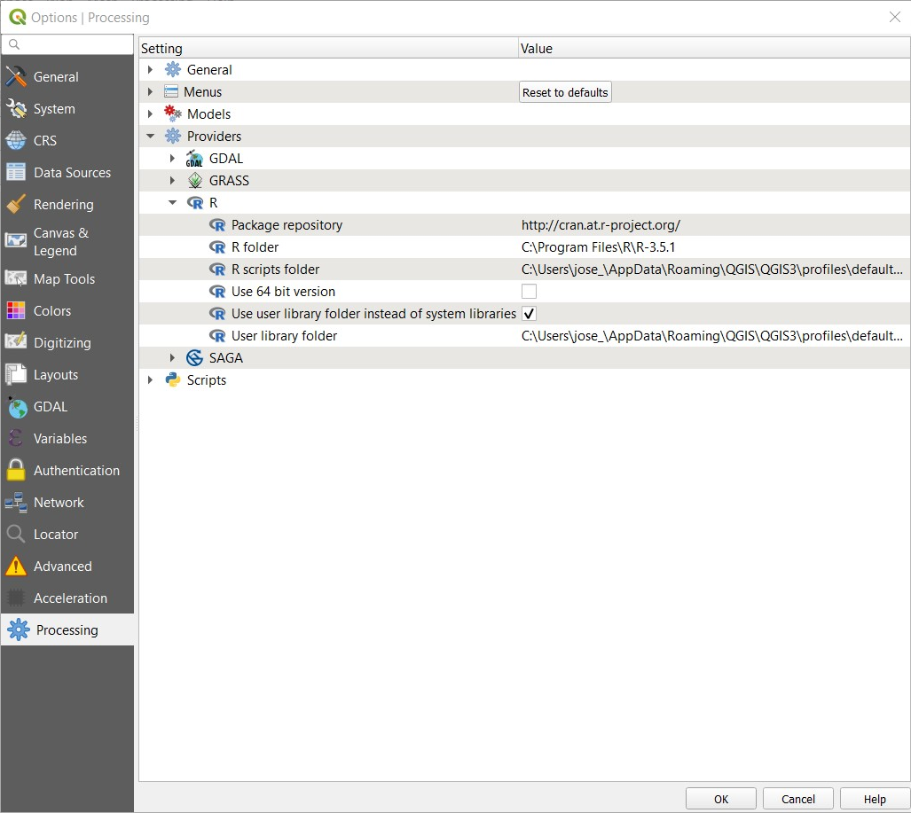

# Introduction
This is a set of R scripts for QGIS. must have [QGIS 3.4](https://qgis.org/en/site/forusers/download.html)  at least and [R](https://www.r-project.org/) installed in your computer. Then you have to install the plugin [Processing R provider](https://github.com/north-road/qgis-processing-r) from QGIS.  
Once the Processing R provider plug in is set, you must load the [scripts](Scripts) into the R scripts folder for QGIS. The scripts will automatically be classified in different folders depending on the function.  

## Installation:
To install the Processing R provider go to Plugins/Manage and install plugins...

  
Then in the plug in window select All plug ins and Use the tool bar to search for the Processing R provider plug in, select it and click on Install

Once the plugin is installed, our R scripts will appear in the toolbox. We can access the toolbox by clicking the icon located at the attributes toolbar or ctrl+alt+T
  

  
Then we have to make sure that the R provider is set up correctly, for this we go to options.  

In the options window you have to make sure that the R folder is set up where R is installed (If you are having problems to locat the folder you can use the fucntion `R.home()` in the R console to obtain the path of this folder)

Once that everything is set up you will see a new icon in the processing tooldbox menu and also the new R scripts section. You have to copy the scripts on the R scripts folder and then you will be able to see them in the R section of the processing toolbox

# Spatial Statistics Tools:

* [Average Nearest Neighbor](Scripts/Documentation/Average_Nearest_Neighbor.md)
* Distance Band From Neighbor
* [Incremental Spatial Autocorrelation](Scripts/Documentation/Incremental_Spatial_Autocorrelation.md)
* Spatial Autocorrelation
* Ripleys K (Not working yet)

# Data Manipulation:

* Aggregate