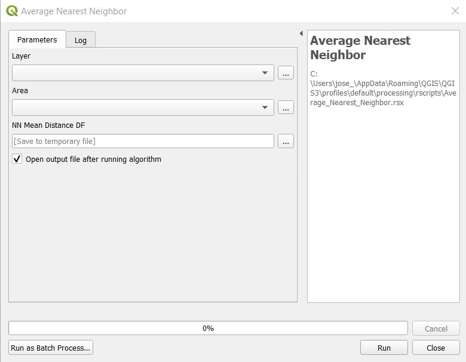

# Average Nearest Neighbor

**This tool provides an Average Nearest Neighbor Mean distance data frame** 

The input parameters are:  
* *Layer:* Must be a point data layer with some values.  
* *Area:* Must be a polygon layer, which will be used to define the study area.  

The output will be a data frame with the columns:  
* *Area:* Size of the study area in .  
* *Observed:* The average distance for the nearest neighbor of the observations.  
* *Expected:* The expected average distance for the nearest neighbor. For this calculation we use the formula: , where A is the area of the polygon shape provided  
* *z:* Th Z value. We use the formula: , where $\bar{D}_O$ is the observed average of nearest neighbor, $\bar{D}_E$ is the expected average of nearest neighbor, and the SE is calculated $SE=\frac{0.26136}{\sqrt{n^2/A}}$.   
* *p.val:* The p-value.  

### [Go Back](../../Readme.md)
