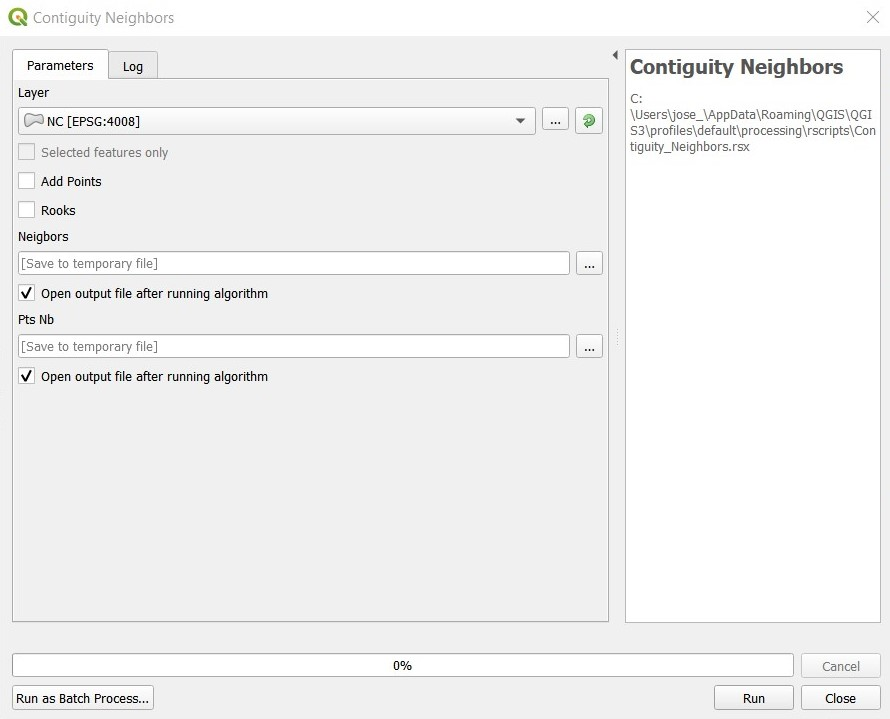
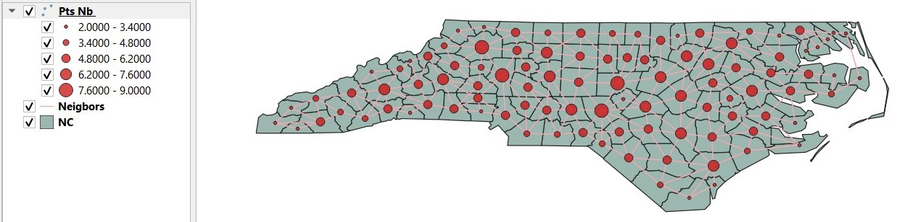

# Contiguity Neighbors

**This tool provides a shapefile of contiguity neighbors based on Rooks or Queens contiguity** 

The input parameters are:  
* *Layer:* Must be a polygon data layer.  
* *Add points:* Will add a point data layer with the information of the neighbors.  
* *Rooks:* Will use rooks contiguity, if left unchecked will use Queens contiguity.  

The output will be a lines data layer (*Neighbors*). If Add points checked, a points data layer (*Pts Nb*) will also be added with the information of the number of neigbors and neighbors IDs for each polygon:  
  

[:back:](../../Readme.md)