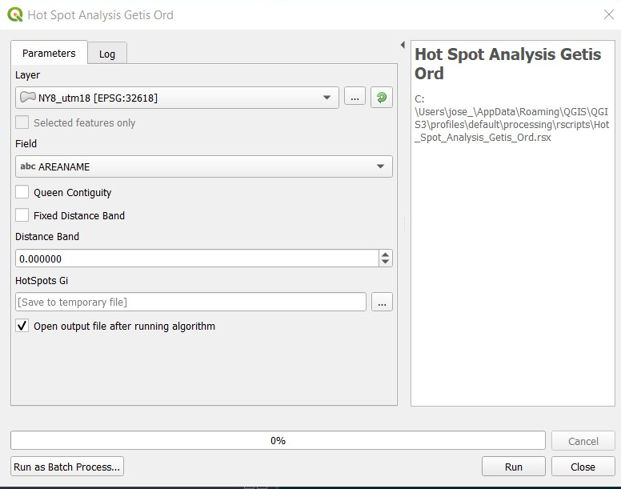

# Hot Spot Analysis Getis-Ord (Gi*)

**This tool allows to identify Cold and Hot spots based on a variable** 

The input parameters are:  
* *Layer:* Must be a point data layer with some values.  
* *Field:* Must be a continous variable, since we are using Z scores, normality is required.  
* *Contiguity:* How are we going to define the weights
* *Distance Band:* For a Fixed Distance Band contiguity only

The output will be a Layer with the fields:  
* *Gi:* The Gi* test statistic.  
* *pval:* The p value computed from the Gi statistic.  
* *Gi_Bin:* The Bin group, this is calculated from the p value and the direction of the Gi statistic. Gi statistics < 0 will be Cold spots, and Gi statistics > 0 will be hot spots. Only the observations with significant p values at alpha = 0.1, 0.05 and 0.01 will be binned, otherwise will be just 0.  

[:back:](../../Readme.md)