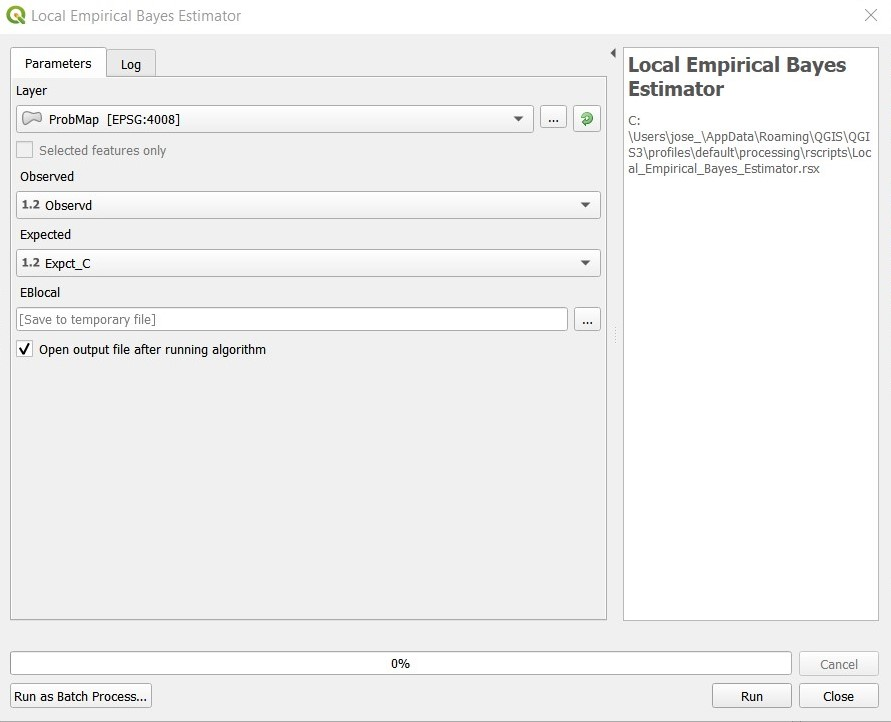
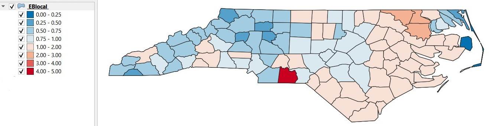

# Local Empirical Bayes Estimator (Based on EBlocal{spdep})

**This tool provides a shapefile of local empirical Bayes estimates for rates "shrunk" to a neighbourhood mean for neighbourhoods given by the nb neighbourhood list** 

The input parameters are:  
* *Layer:* Must be a polygon data layer.  
* *Observed:* Field representing the number of observed cases.  
* *Expected:* Field representing the Expected counts of cases assuming the global rate, can be obtained from the `SMR` or `Probability Mapping Rates` output.  

The output will be polygons layer with the variables:  
* *raw:* A numerical vector of crude rates.  
* *est:* A numerical vector of local empirical Bayes estimates.  

  
The map will be graduated based on the local empirical bayes estimates (est variable).  

## References:  
Marshall R M (1991) Mapping disease and mortality rates using Empirical Bayes Estimators, Applied Statistics, 40, 283–294; Bailey T, Gatrell A (1995) Interactive Spatial Data Analysis, Harlow: Longman, pp. 303–306.  
  
[:back:](../../Readme.md)