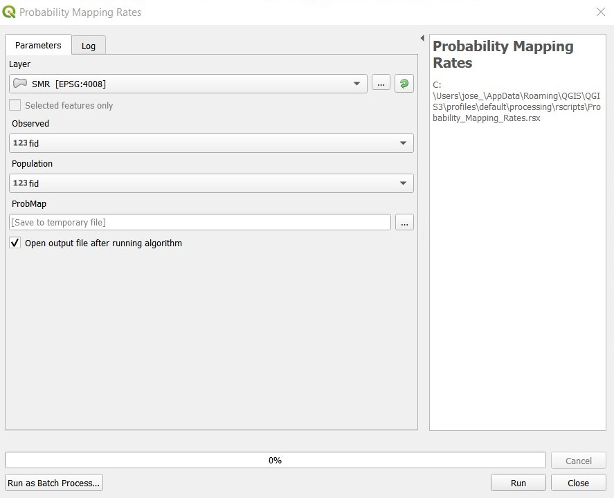
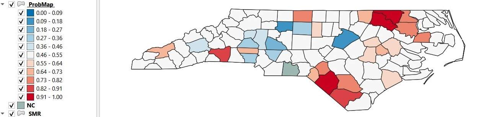

# Probability Mapping Rates (Based on probmap{spdep})

**This tool provides a shapefile of rates for counts in population at risk with expected counts of cases, Relative risk and Poisson probabilities** 

The input parameters are:  
* *Layer:* Must be a polygon data layer.  
* *Observed:* Field representing the number of observed cases.  
* *Population:* Field representing the population at risk.  

The output will be polygons layer with the variables:  
* *Population:* Number of population at risk.  
* *Observed:* Number of observed cases.  
* *Expected_Counts:* Expected counts of cases assuming the global rate.  
* *Relative_Risk:* Ratio of observed and expected counts multiplied by 100.  
* *Pmap:* Poisson probability map values. Probability of getting a more "extreme" count than actually observed
  
The map will be graduated based on the probabilities (Pmap variable).  

## References:  
Bailey T, Gatrell A (1995) Interactive Spatial Data Analysis, Harlow: Longman, pp. 300–303.  
  
[:back:](../../Readme.md)