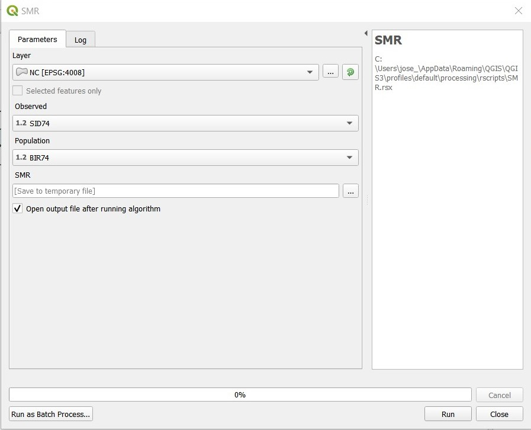
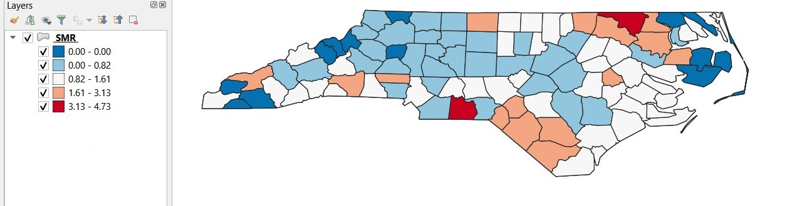

# SMR (Standardized Morttality Ratio)

**This tool provides a shapefile of the standardized mortality ratio** 

The input parameters are:  
* *Layer:* Must be a polygon data layer.  
* *Observed:* Field representing the number of observed cases.  
* *Population:* Field representing the population at risk.  

The output will be polygons layer with the variables:  
* *Population:* Number of population at risk.  
* *Observed:* Number of observed cases.  
* *Expected:* Expected counts of cases assuming the global rate.  
* *SMR:* Ratio of observed and expected counts.  

  
The map will be graduated based on the SMR (SMR variable).  

  
[:back:](../../Readme.md)